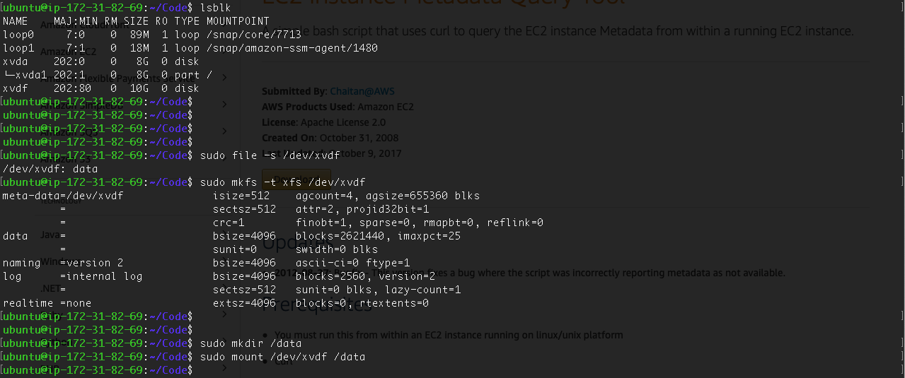

<h2 align="middle"> CSC 4160 Homework 2 </h2>
<h4 align="middle"> Yuan Changcheng 116010276 </h4>
---

### Question 1 - 8.4:

---

### Question 2 - 8.5:

For this question, I created a S3 bucket for cloud storage. Then , I downloaded the android application code and added the verification code into the application to enable my application as a AWS client. 

Then, I tried the code on two android platforms, Google Pixel 3 and Huawei Mate 10 pro. First I tried to upload the picture on Google Pixel 3. As you can see that the picture is not in the bucket initially. Then, the picture could be seen from the bucket using either Huawei or Pixel. Then, I could downoad the picture from Huawei as long as it shares the same verification code and S3 bucket as the Pixel phone. Then, I could view the picture using Huawei.  

<figure class="half" align="middle">
  
  
  
  
</figure>

At last, I checked the S3 bucket and found the picture is in bucket along with my two previous pictures. 

---

### Question 3 - 8.8:

For this question, I created a EC2 instance to do the experiment. However, I found that EC2 has already attached a volume when creating. Thus, I created a volume to practise the attaching process. Note that the availability zone of the volume should be the same as the EC2's availability zone. 


After creating the volume, I need to attach it to the EC2, which is basically mounting the volume space. I ran the following command to attach. Generally, `lsblk` would show show the available block device that this instance could use. From the picture below, we could see that the `xvdf` is not mounted by the instance and it does not have any file system on it. Then, I use `mkfs` to create `xfs` file system on the disk. At last, the attached volume could be mounted. 



  As you can see from the picture below, the `xvdf` is mounted. 


Using the command provided, we could check the `ami-launch-index`, `instance-id`, `public-hostname`, and so on. 


---

### Question 4 - 8.11:

For this question, I tried to run the demo provided by Amazon for Spark practice. Spark is developed based on MapReduce. The main diffeence is that Spark would read and store all the data in memory instead of HDFS. This feature makes Spark faster and more eligible for different types of jobs. I first created a Spark cluster and then launch the Spark shell using the command below.

```bash
$ spark-shell
```

First, I used the `sc` command to check the Spark content. 


Then, I followed the command provided gradually, creating a Resilient Distributed Dataset, mapping the data in lines and then reducing to groups using their keys. After caching and sorting, I get the result below. 


---

### Question 5 - 8.14:

To measure the performance of the MapReduce under different configuration. I tested the matrix mulplication with the cluster using 1 master node and 0,1,2,3 slave node. The result could be seen from the picture below. Note that using student account, the `m3.xlarge` could not be used. Hence, I would use the `m5.xlarge` instead. 

<figure class="half" align="middle">
  
  
  
  
</figure>


---

